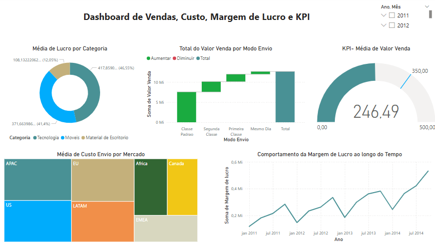

# Dashboard de Vendas, Custo, Margem de Lucro e KPI

Este repositório contém um relatório do Power BI para análise de vendas, custos, margens de lucro e KPIs.

## Arquivos
- `vendas-kpi.pbix` – Arquivo do Power BI.
- `vendas-kpi.png` – Captura de tela do dashboard principal.

