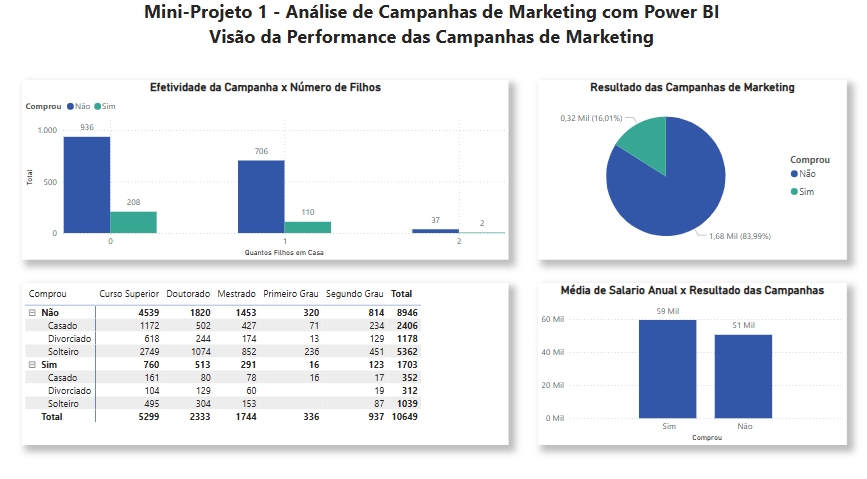
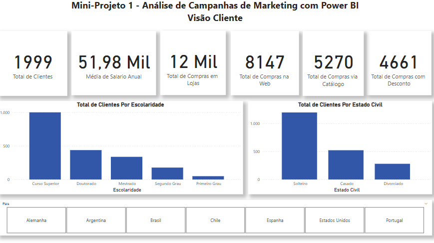
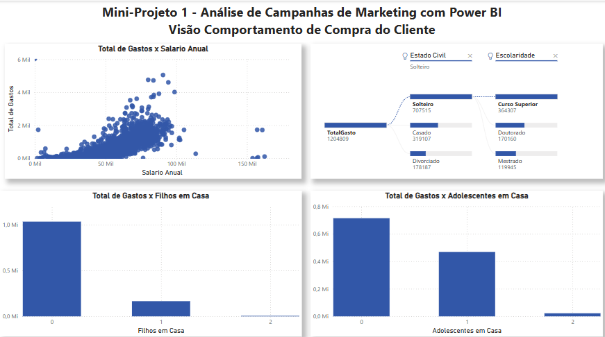
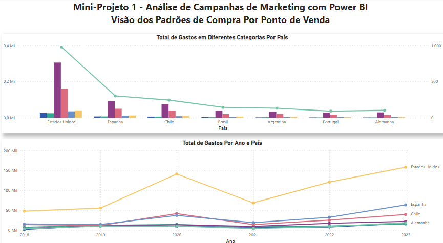

# Análise de Campanhas de Marketing com Power BI.

Este repositório contém um relatório do Power BI para análise de campanhas de marketing.

## Arquivos
- `dash-marketing.pbix` – Arquivo do Power BI.
- `visaocampanhas.png` – Captura de tela do dashboard principal.
- `visaocliente.png` - Captura de tela do dashboard de clientes.
- `visaocomportamento.png` - Captura de tela do dashboard de comportamento.
- `visaopontovendas.png` - Captura de tela do dashboard de vendas.
